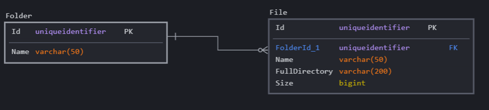

# File scanner

## Original task

Create a program that will take a directory path as input, which
After taking the path, it will scan all files from the folder.
Will collect information about files - Id, name, size, full path.
That data will be added to the database (One table with the mentioned
columns: Id, name, size, full path).

### Upgrade the app to now scan and visit.

After finding a folder, it will go inside it to scan files further (if
it finds another folder in the folder, it will go inside it).
Every time a folder is found, it will save its name and created Id.
Each file found must have the ID of the folder it belongs to.

Suggested database structure:

### Recursion

Bonus point if you have a database structure where you can create
subfolders of subfolders and trace the entire path from the root
folder to the file.

## Solution

We'll solve it in 3 stages:

### Stage 1

Write a simple file scanner that will scan a given directory, print out information about files. See details in [stage-1](./stage-1/README.md).

### Stage 2

Expand the file scanner to also scan subdirectories, still just printing out information about files. See details in [stage-2](./stage-2/README.md).

### Stage 3

Create a database, and change the file scanner to save information about files to the database. See details in [stage-3](./stage-3/README.md).

