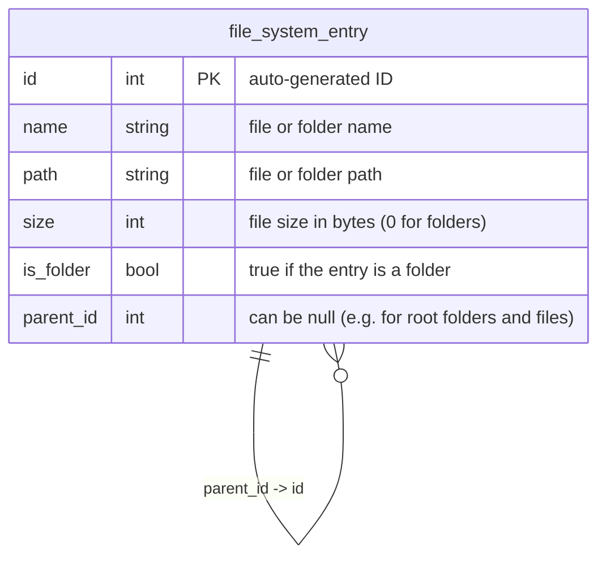

# Stage 3

So far we've created a file scanner that can scan a given directory and print out information about files.

## Idea

Now we'll expand the stage 2 approach. The logic will be the same, but instead of printing out information about files, we'll save it to a database.

## Database

Instead of a database structure proposed in the task, we'll use a recursive structure that will allow us to store files
and folders in the same table.



This will allow us to create a folder structure containing subfolders and files in the same table. This is called a [recursive relationship](https://en.wikipedia.org/wiki/Recursive_relationship) structure.

Here is the SQL script to create the table:

```sql
CREATE TABLE file_system_entry (
    id INTEGER PRIMARY KEY GENERATED ALWAYS AS IDENTITY,
    name TEXT NOT NULL,
    path TEXT NOT NULL,
    size INTEGER NOT NULL,
    is_folder INTEGER NOT NULL,
    parent_id INTEGER
);
```

The database will be PostgreSQL. We'll use [Npgsql](https://www.npgsql.org/) to connect to it.

## Implementation

Let's add a dependency on Npgsql to the project. Run the following command from the folder where the project file is located:

```powershell
dotnet add package Npgsql
```

Now let's update the `Program.cs` file to use the database:

```csharp
using Npgsql;

namespace FileScanner;

class Program
{
    static void Main(string[] args)
    {
        // get the path to scan from the command line arguments
        var path = args[0];

        // create a connection to the database
        var connectionString = "Host=localhost;Username=postgres;Password=postgres;Database=file-scanner";
        using var connection = new NpgsqlConnection(connectionString);
        connection.Open();

        // call the scanner function
        Scan(connection, path);
    }

    static void Scan(NpgsqlConnection connection, string path, int? parentId = null)
    {
        // get all files in the directory
        var files = Directory.EnumerateFiles(path);

        // for each file in the directory
        foreach (var file in files)
        {
            // save information about the file to the database
            var fileInfo = new FileInfo(file);
            
            var command = new NpgsqlCommand("INSERT INTO file_system_entry (name, path, size, is_folder, parent_id) VALUES (@name, @path, @size, @is_folder, @parent_id)", connection);
            command.Parameters.AddWithValue("name", fileInfo.Name);
            command.Parameters.AddWithValue("path", fileInfo.FullName);
            command.Parameters.AddWithValue("size", fileInfo.Length);
            command.Parameters.AddWithValue("is_folder", false);
            command.Parameters.AddWithValue("parent_id", NpgsqlTypes.NpgsqlDbType.Integer, (object)parentId ?? DBNull.Value);
            command.ExecuteNonQuery();
        }

        // get all subdirectories in the directory
        var directories = Directory.EnumerateDirectories(path);

        // for each subdirectory in the directory
        foreach (var directory in directories)
        {
            // save information about the subdirectory to the database
            var directoryInfo = new DirectoryInfo(directory);
            
            var command = new NpgsqlCommand("INSERT INTO file_system_entry (name, path, size, is_folder, parent_id) VALUES (@name, @path, @size, @is_folder, @parent_id) RETURNING id", connection);
            command.Parameters.AddWithValue("name", directoryInfo.Name);
            command.Parameters.AddWithValue("path", directoryInfo.FullName);
            command.Parameters.AddWithValue("size", 0);
            command.Parameters.AddWithValue("is_folder", true);
            command.Parameters.AddWithValue("parent_id", NpgsqlTypes.NpgsqlDbType.Integer, (object)parentId ?? DBNull.Value);

            // execute the command and get the generated ID for this subdirectory
            var id = (int)command.ExecuteScalar();

            // call the scanner function for the subdirectory (this is the recursion)
            Scan(connection, directory, id);
        }
    }
}
```

See the [full code](./stage-3/FileScanner/Program.cs).

## Testing

To test it, let's use the same folder as in stage 2, and run the application.

```powershell
dotnet run --project stage-3/FileScanner test-data
```

This should not print anything to the console, but if you check the database, you should see the following:

```sql
SELECT * FROM file_system_entry;
```

| id | name | path | size | is_folder | parent_id |
| --- | --- | --- | --- | --- | --- |
|1|goodbye.txt|C:\your-repo\test-data\goodbye.txt|36|False|NULL|
|2|hello.txt|C:\your-repo\test-data\hello.txt|32|False|NULL|
|3|subfolder1|C:\your-repo\test-data\subfolder1|0|True|NULL|
|4|goodbye.txt|C:\your-repo\test-data\subfolder1\goodbye.txt|46|False|3|
|5|hello.txt|C:\your-repo\test-data\subfolder1\hello.txt|42|False|3|
|6|subfolder1a|C:\your-repo\test-data\subfolder1\subfolder1a|0|True|3|
|7|goodbye.txt|C:\your-repo\test-data\subfolder1\subfolder1a\goodbye.txt|48|False|6|
|8|hello.txt|C:\your-repo\test-data\subfolder1\subfolder1a\hello.txt|44|False|6|
|9|subfolder2|C:\your-repo\test-data\subfolder2|0|True|NULL|
|10|goodbye.txt|C:\your-repo\test-data\subfolder2\goodbye.txt|46|False|9|
|11|hello.txt|C:\your-repo\test-data\subfolder2\hello.txt|42|False|9|
|12|subfolder3|C:\your-repo\test-data\subfolder3|0|True|NULL|


This is pretty much the same was as an operating system stores files and folders.

To see the benefit of storing files and folders in the same table, let's try to find all files and subfolders in a folder. (You have to escape the backslashes `\`, so they become `\\`.)

```sql
select * from file_system_entry where path like 'C:\\your-repo\\test-data\\subfolder1\\%';
```

You should see the following:

| id | name | path | size | is_folder | parent_id |
| --- | --- | --- | --- | --- | --- |
|4|goodbye.txt|C:\your-repo\test-data\subfolder1\goodbye.txt|46|False|3|
|5|hello.txt|C:\your-repo\test-data\subfolder1\hello.txt|42|False|3|
|6|subfolder1a|C:\your-repo\test-data\subfolder1\subfolder1a|0|True|3|
|7|goodbye.txt|C:\your-repo\test-data\subfolder1\subfolder1a\goodbye.txt|48|False|6|
|8|hello.txt|C:\your-repo\test-data\subfolder1\subfolder1a\hello.txt|44|False|6|

This is a lot easier than having to join multiple tables to get the same result.

That's it! 🎉
